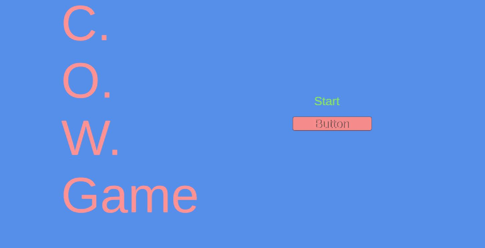

## C.O.W. Game
Created by Rhys Cabot in an absurd timecrunch from finals week

## ABOUT:
- Cow Game is a top down action roguelike where you evade progressively more dangerous waves of animals as a cow who can shoot fireballs by pressing 'P'.
- Prove your farm animal supremacy by besting wave after wave of dangerous sheep and their dangerous genetically modified elites!

## FEATURES:
- Not everything I set out to do!
- A working start menu
- Enemies that track the player
- 2-dimensional cow mooooovement
- Fireballs!
-(Additonal note: Fireballs will be replaced with landmines after the first enemy is slain due to a scripting error, though this can be avoided by intentionally keeping said enemies alive.)
- Leveling up to increase stats!
- Working health values, and a Game Over screen when health reaches 0!
- Elite enemies that can spawn after Wave 10!
- A Game that is excessively hard to get screenshots of on a computer with no printscreen button!
- A UI that doesn't scale properly to resolution!
- A enemy director that for some reason works a lot slower in the WebGL build, presumably due to runspeed errors. (For the better experience with more enemies, try the Unity proect files.)

(Title screen seen above)

## Future roadmap:
- I may or may not develop this idea into something more complete as a side project, since I really do want to try my hand at a functioning roguelike.
- That said, I would probably want to try making it in Unity 2D first, which would mean learning how to work with 2D

